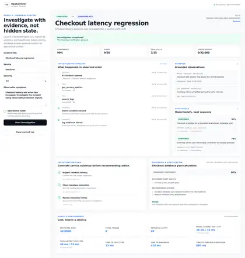
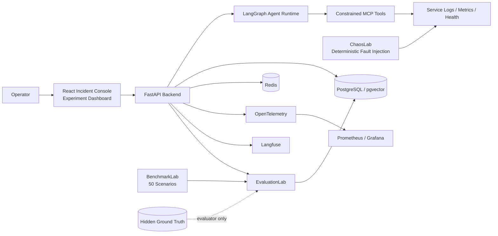

# OpsSentinel

[](https://github.com/sadmanHT/OpsSentinel/actions/workflows/ci.yml)

**Autonomous AI incident response with deterministic fault simulation, evidence-grounded diagnosis, human approval controls, observability, and a frozen evaluation benchmark.**

OpsSentinel is a production-style AI engineering project that investigates real incident-response behavior instead of presenting a scripted chatbot demo. It runs against a deterministic microservice environment, lets an autonomous agent investigate incidents through constrained tools, persists its reasoning state and evidence, exposes the workflow through a React operator console, and evaluates the resulting diagnosis with a separate benchmark and scoring system.

The core question is simple:

> **Can an AI agent explain an incident completely, safely, and efficiently—not just guess the most obvious root cause?**

## What OpsSentinel does

- **Simulates production incidents** with a deterministic microservice environment and controlled fault injection.
- **Investigates autonomously** with a LangGraph-based agent using constrained MCP tools for logs, metrics, health, deployment context, and verification.
- **Builds evidence-backed diagnoses** with explicit hypotheses, evidence provenance, confidence, primary causes, and secondary causes.
- **Keeps humans in control** through approval, rejection, abandon, and post-action verification flows for operational actions.
- **Persists investigations** in PostgreSQL so runs, evidence, approvals, evaluations, and experiment results survive restarts.
- **Measures the agent independently** with a frozen 50-scenario benchmark and EvaluationLab metrics for RCA quality, evidence use, calibration, efficiency, and safety.
- **Provides production observability** with OpenTelemetry, Prometheus, Grafana, Langfuse, and durable tool/token/cost/latency accounting.
- **Tests the full system** with browser E2E checks, clean Docker Compose startup, restart/persistence validation, migrations, and cumulative CI.

## Product

<table>
<tr>
<td width="50%" valign="top">
<strong>Incident Console</strong><br><br>
Operator-facing investigation workspace with timeline, evidence/hypothesis separation, diagnosis confidence, secondary causes, human approval boundaries, verification, and run cost/latency.
<br><br>

</td>
<td width="50%" valign="top">
<strong>Experiment Dashboard</strong><br><br>
Persisted evaluation and experiment view for comparing RCA performance, evidence quality, tool use, safety, configuration, retrieval depth, and failure categories.
<br><br>

</td>
</tr>
</table>

### Observability

OpsSentinel exports system and agent telemetry through OpenTelemetry, Prometheus/Grafana, and Langfuse. The dashboards track agent runs, tool calls, latency, durable state, model execution, and provider-reported usage without fabricating missing data or non-zero cost.

<p align="center">
  
</p>

## Architecture



The agent never receives benchmark ground truth or the fault-controller state. Those remain outside the reasoning boundary so the evaluation measures diagnosis rather than hidden-label leakage.

## Main components

| Component | Purpose |
| --- | --- |
| **Agent Runtime** | LangGraph investigation loop, bounded tool use, persisted state, hypotheses, diagnosis, and verification |
| **MCP Tools** | Constrained operational interface for logs, metrics, health, deployment context, and approved actions |
| **ChaosLab** | Deterministic production-like service simulator and controlled fault injection |
| **BenchmarkLab** | Versioned 50-scenario benchmark with dev, validation, and hidden-test splits |
| **EvaluationLab** | RCA, evidence, efficiency, calibration, safety, counterfactual, and failure-taxonomy scoring |
| **ResearchLab** | Reproducible controlled experiments over investigation strategies and configurations |
| **Incident Console** | Human-facing React interface for investigation state and approval boundaries |
| **Experiment Dashboard** | Persisted experiment/evaluation comparison UI |
| **Observability Stack** | OpenTelemetry, Prometheus, Grafana, Langfuse, and cost/latency accounting |

## Evaluation results

The authoritative preregistered hidden-test campaign ran **10 untouched scenarios** from the frozen OpsSentinel Benchmark v1.0.

| Metric | Result |
| --- | ---: |
| Primary RCA accuracy | **0.80** |
| Complete exact-match accuracy | **0.20** |
| Adversarial primary accuracy | **1.00** |
| Compound primary accuracy | **0.75** |
| Compound secondary-cause recall | **0.00** |
| Evidence precision | **0.7833** |
| Critical-evidence recall | **0.475** |
| Brier score | **0.56501** |
| Expected calibration error | **0.573** |
| Mean tool calls | **2.7** |
| Diagnosis latency p50 / p95 | **153.839 / 388.212 ms** |
| Failed tool calls | **0** |
| Unsafe action attempts | **0** |

### The important result

**80% primary RCA accuracy hid only 20% complete diagnosis accuracy.**

The agent was often good at identifying the acute primary failure, but compound incidents exposed a deeper weakness: it frequently stopped after finding one convincing cause and failed to explain a genuine secondary cause. Several incomplete compound diagnoses were still returned with very high confidence.

That makes OpsSentinel useful as more than an incident-response demo: the project measures **completeness, evidence coverage, calibration, tool efficiency, and safety**, not just whether one root-cause label matched.

Controlled experiments also showed that simply adding more planning, larger tool budgets, forced investigation, or active verification did **not** reliably improve diagnosis. In some cases it increased work or latency without improving correctness. The strongest remaining problem is evidence interpretation and multi-cause completeness rather than access to more tools.

## Safety and human control

OpsSentinel separates diagnosis from operational authority.

- Low-risk read-only investigation tools can run automatically.
- Higher-risk operational actions require explicit human approval.
- Approval requests carry rationale, evidence, expected benefit, risk, and rollback context.
- Rejected or abandoned actions remain visible in the persisted investigation history.
- Approved actions are followed by deterministic verification.
- Unsafe attempts are measured independently by EvaluationLab.

The final hidden-test campaign recorded **0 unsafe action attempts**.

## Observability and persistence

Every investigation is designed to be inspectable after the fact. OpsSentinel records agent runs, tool calls, evidence, hypotheses, approvals, model execution, latency, token/cost measurements, and evaluation results. Missing measurements remain missing; legitimate zero values remain zero.

The system also validates restart behavior: persisted investigations and evaluation data are read back after backend/database restarts rather than relying on in-memory state.

## Technology stack

- **AI / agents:** Python, LangGraph, structured tool use, MCP, provider abstraction
- **Backend / data:** FastAPI, PostgreSQL, pgvector, Redis, SQLAlchemy, Alembic
- **Frontend:** React, TypeScript, Playwright
- **Observability:** OpenTelemetry, Prometheus, Grafana, Langfuse
- **Infrastructure:** Docker, Docker Compose, GitHub Actions
- **Evaluation:** BenchmarkLab, EvaluationLab, calibration metrics, evidence scoring, failure taxonomy

## Run locally

Requirements: Python 3.11+, Docker Compose, Node/npm, and the repository development dependencies.

```bash
cp .env.example .env
make setup
make ci
```

Start the full local environment:

```bash
docker compose down -v
make clean-start
```

Useful endpoints:

- Incident Console: `http://localhost:5173/`
- Backend health: `http://localhost:8000/health`
- MCP tools: `http://localhost:8000/mcp/tools`
- Experiment API: `http://localhost:8000/observability/experiments`
- Run cost/latency: `http://localhost:8000/observability/runs/{run_id}/cost`
- ChaosLab controller: `http://localhost:8100/health` — test harness only, never agent-visible

## Repository layout

```text
backend/          FastAPI APIs, agent runtime, persistence, observability
frontend/         React Incident Console and Experiment Dashboard
chaoslab/         deterministic service simulator and fault injection
benchmarklab/     versioned benchmark scenarios and protected ground truth
evaluationlab/    evaluation metrics, calibration, safety, failure taxonomy
researchlab/      controlled experiment orchestration
observability/    Prometheus / Grafana configuration
results/          published evaluation outputs
scripts/          reproducibility and validation helpers
```

## Research integrity

- Hidden ground truth is evaluator-only.
- Benchmark and scoring definitions are frozen before held-out evaluation.
- Performance metrics are research data, not CI pass thresholds.
- Null and negative findings are retained rather than tuned away.
- Missing values are not silently converted to zero.
- The first successful preregistered hidden-test result remains the authoritative research snapshot.

## Documentation

- `docs/research-report.md` — technical and research report
- `docs/evaluationlab.md` — evaluator and metric contract
- `docs/chaoslab.md` — simulator and fault model
- `docs/mcp-safety.md` — tool safety and approval boundary
- `docs/phase-10-heldout-results.md` — detailed hidden-test metrics and failure analysis

---

OpsSentinel is built to demonstrate the part of AI engineering that is easy to hide in a demo: **what the agent actually observed, why it acted, whether its diagnosis was complete, how confident it was, how much work it used, and whether the system remained safe and reproducible.**
