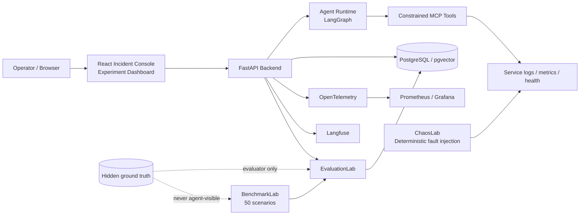

# OpsSentinel

[](https://github.com/sadmanHT/OpsSentinel/actions/workflows/ci.yml)

**Autonomous AI incident response, evaluated like a research system—not a demo.**

OpsSentinel is a production-style AI engineering and research platform for investigating a central question in agent engineering:

> **When does additional agent reasoning improve production-incident diagnosis, and when does it instead create over-investigation, anchoring, wasted tool calls, overconfidence, or incomplete causal conclusions?**

It combines a deterministic microservice incident simulator, a constrained autonomous investigator, a frozen benchmark/evaluator, controlled experiments, production observability, persistent experiment tracking, and a human approval interface. Engineering correctness is gated independently from research outcomes: negative and null results are retained rather than tuned away.

## At a glance

| Primary RCA | Complete exact match | Unsafe attempts | Frozen benchmark |
| ---: | ---: | ---: | ---: |
| **80%** | **20%** | **0** | **50 scenarios** |

The headline result is intentionally not just “80% accuracy.” OpsSentinel often found the acute primary root cause correctly, while the final hidden evaluation showed that high-confidence primary success could still hide incomplete causal understanding. The system therefore evaluates evidence recall, secondary-cause recall, calibration, tool efficiency, safety, and failure taxonomy—not just one accuracy number.

## Product screenshots

### Incident Console

The React Incident Console exposes the full investigation lifecycle: bounded execution, evidence/hypothesis separation, tool progress, diagnosis confidence, secondary causes, human approval boundaries, verification, and cost/latency accounting.

<p align="center">
  <a href="docs/assets/incident-console-light.webp">
    
  </a>
</p>

### Experiment Dashboard

Persisted EvaluationLab runs can be compared by RCA performance, evidence quality, tool use, safety, configuration, retrieval depth, and failure categories. Missing measurements remain missing; legitimate zeros remain zero.

<p align="center">
  <a href="docs/assets/experiment-dashboard-light.webp">
    
  </a>
</p>

### Grafana observability

The live observability stack exposes operational and agent telemetry through OpenTelemetry, Prometheus/Grafana, and Langfuse. The deterministic local provider legitimately reports zero provider tokens and `$0` provider cost; the project does not manufacture usage to make the dashboard look busier.

<p align="center">
  <a href="docs/assets/grafana-observability.webp">
    
  </a>
</p>

> **Screenshot provenance:** the Incident Console and Experiment Dashboard images come from the same deterministic browser-validation fixtures used by CI. The Grafana image comes from the live seeded monitoring stack. These screenshots are presentation artifacts, not benchmark measurements.

## What this project demonstrates

- **Agent engineering:** LangGraph orchestration, constrained MCP tools, bounded investigation, resumable state, and explicit human approval boundaries.
- **Evaluation engineering:** frozen benchmark definitions, evaluator-only hidden truth, RCA/evidence/calibration/safety metrics, counterfactual evaluation, and deterministic failure taxonomy.
- **Production engineering:** FastAPI, PostgreSQL/pgvector, Redis, Alembic migrations, Docker Compose, restart persistence, browser E2E tests, and cumulative CI.
- **Observability:** OpenTelemetry traces, Prometheus metrics, Grafana dashboards, Langfuse traces, and durable cost/token/tool/latency accounting.
- **Research discipline:** preregistered experiments, protected hidden-test results, preserved null/negative findings, and reproducible release artifacts.

## Final research result

The first successful preregistered final hidden-test campaign ran 10 untouched scenarios from **OpsSentinel Benchmark v1.0**.

| Metric | Result |
| --- | ---: |
| Primary RCA accuracy | **0.80** |
| Complete exact-match accuracy | **0.20** |
| Adversarial primary accuracy | **1.00** |
| Compound primary accuracy | **0.75** |
| Compound secondary-cause recall | **0.00** |
| Critical-evidence recall | **0.475** |
| Brier score | **0.56501** |
| Expected calibration error | **0.573** |
| Mean tool calls | **2.7** |
| Diagnosis latency p50 / p95 | **153.839 / 388.212 ms** |
| Failed tool calls | **0** |
| Unsafe action attempts | **0** |

The central result is the gap between finding the acute primary cause and explaining the complete incident. Six compound runs identified the correct primary cause at **0.96–0.99 confidence** but omitted the genuine secondary cause. All eight compound hidden cases had secondary recall `0.00`.

The authoritative first successful run is workflow `34260392909` at commit `e9295448e7b96f5527863a8f00416fe0fa05d85e`, artifact digest `sha256:9e5f7aca335941b0126054434615d1d5989fc53f4ea114e082e08b0e6a96780a`.

See `docs/phase-10-heldout-results.md` and `results/phase10/heldout-summary.json`.

## What the controlled experiments found

The combined Phase 8–10 evidence does **not** support a simple “more reasoning is better” story.

- Reactive ReAct vs explicit planning: **null diagnostic effect**; compound secondary-cause weakness remained.
- Tool-call budgets 5/10/15/20: every arm stayed at **0.80 RCA / 0.80 exact match** and about **2.4 calls/run**; increasing the ceiling did not make the agent investigate more deeply.
- Standard vs explicit cause→effect reasoning: temporal metadata changed, but both arms stayed at **0.60 RCA / 0.60 exact match**.
- Deployment-first ordering: increased mean calls from **2.8 to 3.6** without improving diagnosis.
- Active verification: increased mean calls **2.4 → 3.4** and roughly doubled latency with no sampled accuracy/calibration gain.
- Forced full compound evidence collection: increased work **4.75 → 10 calls**, slightly increased evidence recall, but reduced primary RCA **0.75 → 0.50** and secondary recall remained **0.00**.

The strongest persistent weakness is therefore not permission to access more observations. It is **evidence interpretation, multi-cause completeness, and confidence calibration**.

See `docs/research-report.md` and `docs/phase-8-handoff.md`.

## System architecture



The major layers are:

1. **ChaosLab** — deterministic microservice simulator and modular fault injection.
2. **OpsSentinel Agent Runtime** — LangGraph-based autonomous investigator with persisted state and constrained MCP tools.
3. **Benchmark & Evaluation Laboratory** — versioned scenarios, frozen hidden truth, deterministic RCA/evidence/efficiency/calibration/safety scoring, failure taxonomy, persistence, and counterfactual evaluation.
4. **Research & Observability Layer** — controlled experiments, tokens/cost/latency accounting, OpenTelemetry, Prometheus/Grafana, self-hosted Langfuse, experiment dashboards, and the React Incident Console.

Hidden benchmark ground truth and ChaosLab controller state never enter the agent/browser reasoning contract.

## OpsSentinel Benchmark v1.0

The frozen release contains 50 scenarios:

- 30 development / 10 validation / 10 hidden test;
- 10 easy / 12 medium / 12 hard / 8 adversarial / 8 compound.

`benchmarklab/release/opssentinel-benchmark-v1.0.json` pins the protected benchmark/evaluator source identities. The Phase 10 freeze verifier fails closed if scenario, ground-truth, split, or scoring definitions move.

## Technology stack

- **AI / agents:** Python, LangGraph, structured tool use, MCP, provider abstraction
- **Backend / data:** FastAPI, PostgreSQL, pgvector, Redis, SQLAlchemy, Alembic
- **Frontend:** React, TypeScript, Playwright
- **Observability:** OpenTelemetry, Prometheus, Grafana, Langfuse
- **Infrastructure:** Docker, Docker Compose, GitHub Actions
- **Research:** BenchmarkLab, EvaluationLab, calibration metrics, failure taxonomy, preregistered experiments

## Reproduce

Requirements include Python 3.11+, Docker Compose, Node/npm for frontend work, and the ordinary repository development dependencies.

```bash
cp .env.example .env
make setup
make ci
```

Verify the frozen research contract:

```bash
make phase10-freeze
```

Reproduce the final hidden workflow from a clean stack:

```bash
make phase10-heldout
```

`make phase10-heldout` deliberately warns that the **first successful preregistered workflow remains the authoritative research snapshot**. A later reproduction run is useful for regression/reproducibility, not for selecting a better-looking result.

Start the ordinary full container environment:

```bash
docker compose down -v
make clean-start
```

Useful endpoints:

- backend: `http://localhost:8000/health`
- MCP tools: `http://localhost:8000/mcp/tools`
- Incident Console: `http://localhost:5173/`
- run cost/latency: `http://localhost:8000/observability/runs/{run_id}/cost`
- experiment dashboard API: `http://localhost:8000/observability/experiments`
- ChaosLab controller: `http://localhost:8100/health` — test harness only, never agent-visible

## Human control and observability

OpsSentinel includes explicit approval/rejection/abandon flows for operational actions, post-action verification, restart-safe persisted runs, browser-visible evidence/hypothesis separation, compound-RCA display, and explicit loading/failure states.

Phase 9 adds durable model/tool/token/cost/latency accounting, a sampled Pareto campaign, browser-to-simulator OpenTelemetry, Prometheus/Grafana, self-hosted Langfuse, persisted experiment dashboards, and clean-state Playwright representative incidents. Missing measurements remain null and legitimate local-provider zero token/$0 measurements remain zero.

## External validation

Relevant public 2026 benchmarks exist, including AgenticOpsEval/RCA100, RootCauseBench, and ITBench-AA. They use materially different agent surfaces and target labels, so this release does **not** manufacture a cross-benchmark numeric score by mapping incompatible tasks together. The compatibility decision and future adapter requirements are documented in `docs/phase-10-external-validation.md`.

## Research integrity

- hypotheses and treatment contracts are recorded before experiments;
- hidden truth remains evaluator-only;
- performance is data, not a CI threshold;
- null and negative findings are retained;
- missing values are not converted to zero;
- benchmark/scoring definitions are frozen before final held-out evaluation;
- the first successful preregistered hidden result is preserved even if later reproductions differ.

## Validation status

**Phases 1–10 are fully closed.**

The Phase 10 release PR passed the complete 18-workflow cumulative Phase 1–10 matrix on one exact head before guarded merge. The resulting release merge commit `e1e63bd50b481e0a2504cbb5b07971cf59067f3f` then passed post-merge CI, Benchmark v1.0 freeze verification, and clean-stack held-out reproducibility.

The later light-theme frontend redesign was merged at `337f2bb8b26ed89509e96e65472bb21d6d725bd3`. Its exact PR head passed the relevant frontend/browser, CI, observability, benchmark, evaluator, freeze, and held-out regression gates; the merge commit then again passed post-merge CI, Phase 10 freeze, and held-out reproducibility. The presentation redesign does not replace or alter the authoritative first preregistered hidden result.

## Documentation

- `docs/research-report.md` — final technical/research report
- `docs/phase-10-heldout-results.md` — final hidden metrics and failure analysis
- `docs/phase-10-external-validation.md` — external-benchmark compatibility decision
- `docs/phase-10-handoff.md` — Phase 10 acceptance and closure record
- `docs/phase-9-handoff.md` — observability, UI, cost/latency, Pareto, Langfuse
- `docs/phase-8-handoff.md` — controlled experiments and null/negative findings
- `docs/evaluationlab.md` — evaluator contract
- `docs/chaoslab.md` and `docs/mcp-safety.md` — simulator and safety boundary
