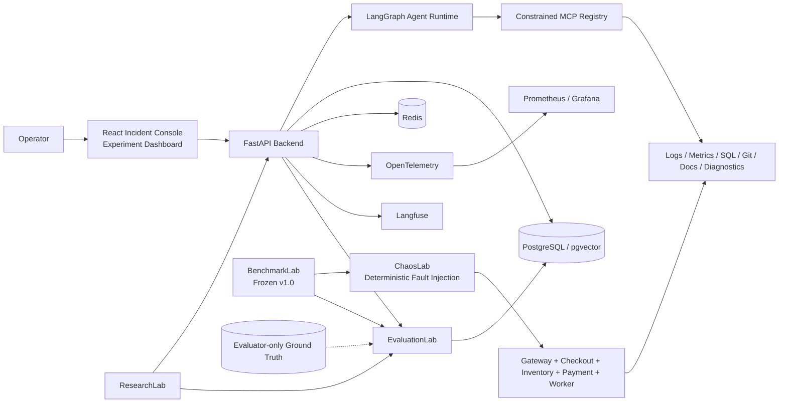

# OpsSentinel Architecture

## Mission

OpsSentinel is an experimental platform for studying when additional reasoning helps autonomous incident-response agents and when it instead creates failure modes such as anchoring, over-investigation, overconfidence, wasted tool use, and incomplete causal conclusions.

The final system is designed as a research platform rather than a production deployment: it combines a deterministic incident simulator, a constrained autonomous investigator, a frozen benchmark/evaluator boundary, durable observability, and human approval controls so software behavior and research claims can be inspected independently.

## System overview

## Core systems

### Frontend and operator workflow

The React frontend provides two human-facing surfaces:

- **Incident Console** — starts and inspects investigations, displays the timeline, separates evidence from hypotheses, shows diagnosis confidence and secondary causes, and exposes approval/rejection/abandon/verification states for operational actions.
- **Experiment Dashboard** — reads persisted EvaluationLab and experiment data so research results can be compared without relying on transient in-memory state.

The browser receives public incident/run state only. Benchmark ground truth and ChaosLab fault-controller state never cross into the frontend path.

### FastAPI backend and persistence

FastAPI provides the application boundary for incident execution, agent state, MCP invocation, approvals, evaluation access, and observability endpoints.

Pydantic models define typed contracts, SQLAlchemy owns persistence mappings, and Alembic owns schema evolution. PostgreSQL + pgvector stores durable incident, run, evidence, hypothesis, tool-call, approval, diagnosis, evaluation, and experiment state. Redis supports ephemeral/runtime coordination where required.

Persistence is part of the correctness model: clean-state and restart validation confirm that investigations and evaluation records survive process/database restarts and can be read back through typed interfaces.

### LangGraph agent runtime

The agent runtime maintains explicit state for:

- incident context and plan;
- evidence and provenance;
- hypotheses and confidence;
- tool history and budgets;
- proposed actions and approval state;
- verification results;
- final diagnosis, including primary and secondary causes;
- retry/recovery state and persisted checkpoints.

The runtime is intentionally bounded. It has configurable step/tool limits, repeated-call protection, timeout/cost controls, persisted resume semantics, and deterministic failure handling. Evidence is kept separate from interpretation, and final factual claims cite evidence identifiers.

### MCP investigation and safety boundary

The agent never receives unrestricted container, host-shell, database, or filesystem access. Investigation occurs through a typed MCP registry covering bounded evidence and diagnostic operations such as logs, metrics, read-only SQL, deployments, Git context, documentation search, and allowlisted diagnostics.

Safety is enforced at the tool boundary:

- **R0** — read-only retrieval, automatic;
- **R1** — allowlisted diagnostics, automatic;
- **R2** — reversible operational action, explicit human approval required;
- **R3** — destructive action, blocked.

SQL is restricted to safe read/explain forms through a dedicated read-only database role. Diagnostic commands map to fixed argument vectors and run with `shell=False`; arbitrary executables, shell fragments, URLs, path traversal, and unauthorized service targets are rejected.

### Human approval and verification

Diagnosis is separated from operational authority. Reversible actions enter a persisted approval lifecycle containing rationale, supporting evidence, expected benefit, risk, and rollback context.

An approved action is executed only after trusted approval state is resolved by the backend. Rejected or abandoned requests remain visible in the investigation record. Approved actions are followed by deterministic verification so the system records whether the intended effect actually occurred.

### ChaosLab

ChaosLab is the deterministic production-like simulator used for development, evaluation, and research. Its topology includes a gateway, checkout, inventory, payment, background worker, PostgreSQL, and Redis-backed scenario state.

The simulator provides bounded, reproducible fault primitives and realistic telemetry while avoiding destructive host behavior. Faults include N+1 query behavior, connection exhaustion, disk exhaustion, configuration/authentication failure, memory leakage, and later benchmark-specific compositions and temporal structures.

The ChaosLab controller is a **test-harness boundary**. It knows which fault was injected and therefore must never be exposed to the agent as an investigation tool.

### BenchmarkLab

OpsSentinel Benchmark v1.0 is frozen at **50 scenarios** across Easy, Medium, Hard, Adversarial, and Compound difficulty tiers, with structural dev/validation/hidden splits.

Scenario definitions contain temporal structure, distractors, controlled counterfactual variants where applicable, fixed seeds, and evaluator-only causal labels. Benchmark launch is independent of agent execution: only a public incident contract is given to the agent, while expected labels remain outside the runtime until post-hoc evaluation.

The release manifest pins the protected benchmark and evaluator source identities. The freeze verifier recomputes those identities and fails closed if the protected research contract changes.

### EvaluationLab

EvaluationLab consumes saved trajectories and computes metrics automatically and reproducibly. It separates dimensions that a single RCA score would hide:

- primary and complete root-cause correctness;
- compound secondary-cause recall;
- evidence precision/recall and critical-evidence recall;
- distractor selection;
- useful, duplicate, irrelevant, misleading, and failed tool use;
- Brier score, expected calibration error, reliability bins/diagrams;
- latency, provider usage/cost, and run completion;
- safety/risk metrics;
- deterministic failure taxonomy;
- counterfactual consistency/sensitivity/invariance when a scorable family exists.

The same saved trajectory must evaluate identically. Research metrics are data, not preferred-result CI thresholds.

### ResearchLab

ResearchLab runs controlled comparisons over investigation architecture and configuration. The implemented experiments cover planning strategy, investigation budget, tool ordering, active verification, temporal reasoning, compound stopping behavior, retrieval depth, and cost/accuracy trade-offs.

Each experiment records the configuration required to interpret and reproduce the result: provider/model identity, seed, prompt/architecture version, benchmark version/split, tool/retrieval settings, raw trajectory, and scores.

Null and negative results are retained. The platform does not change benchmark ground truth or weaken evaluation simply to produce a preferred result.

### Observability

The final observability layer combines:

- OpenTelemetry for request/agent/tool traces;
- Prometheus for operational metrics;
- Grafana for system and agent dashboards;
- Langfuse for agent/model/tool observations and experiment metadata;
- persisted cost/latency summaries in the backend data model.

Tracked values include agent runs, tool calls, model executions, time to diagnosis, p50/p95 latency, retrieval depth, token usage, provider-estimated cost, and durable run state. Missing measurements remain missing; valid zero values remain zero.

The default published benchmark uses the deterministic local reasoning provider. That provider truthfully reports zero provider tokens and zero provider-estimated monetary cost, while the runtime also supports local/Ollama model execution. Those LLM executions are not represented by the published Benchmark v1.0 headline metrics.

## End-to-end research data flow

1. BenchmarkLab selects a versioned scenario and restores ChaosLab to baseline.
2. ChaosLab injects deterministic fault state and generates the scenario's public symptoms.
3. Only the public incident contract is sent to the FastAPI/agent path.
4. The LangGraph runtime investigates through constrained MCP tools and persists evidence, hypotheses, tool history, approvals, and diagnosis state.
5. BenchmarkLab saves the trajectory alongside evaluator-only expected labels in a benchmark artifact.
6. EvaluationLab adapts the saved trajectory into deterministic scoring inputs and computes diagnosis, evidence, efficiency, calibration, safety, and optional counterfactual metrics.
7. ResearchLab groups comparable runs by preregistered configuration for controlled analysis.
8. PostgreSQL stores evaluation and experiment results; OpenTelemetry, Prometheus/Grafana, and Langfuse provide operational and research observability.
9. CI verifies software correctness, isolation, persistence, cleanup, and frozen-research-contract integrity without requiring a preferred accuracy value.

## Trust and isolation boundaries

### Ground truth

Benchmark difficulty, split identity, injected fault truth, expected root-cause labels, and counterfactual truth are evaluator-only. They are excluded from the agent-visible request and frontend state.

### Simulator control

ChaosLab's controller can inject and restore faults but is not part of the agent's legal tool surface. The agent must infer causes from observable service behavior.

### Operational authority

The agent can investigate automatically through R0/R1 operations. R2 actions require backend-resolved human approval. R3 destructive actions are blocked.

### Database and shell access

MCP SQL uses a restricted read-only role. Diagnostics are allowlisted and executed without a shell. The agent has no unrestricted host/container command execution.

## Provider boundary

The agent depends on a provider abstraction rather than a mandatory hosted API. Local/open-model operation is supported, and paid APIs are not required for the project to run.

Provider/model provenance is persisted with experiments so deterministic-provider results cannot be mistaken for Ollama/LLM measurements. The published frozen hidden-test result uses the deterministic evidence-driven provider for reproducibility and evaluator isolation.

## Reproducibility and deployment model

The repository is structured for reproducible local research:

- frontend npm dependencies are locked and installed with `npm ci`;
- backend runtime and development Python dependency graphs are pinned;
- core PostgreSQL/pgvector and Redis container images are digest-pinned;
- the backend runtime container runs non-root;
- the frontend is built as a production static bundle and served by Nginx;
- host service ports are loopback-bound in the included Compose stack;
- migrations, clean startup, restart/recovery, benchmark freeze, held-out execution, and cleanup are validated in CI.

The included Docker Compose environment remains a **local research/development stack**, not an Internet-facing production deployment. A real deployment would still require deployment-specific authentication, authorization, TLS, secret management, network policy, and operator identity controls.

## Final validation state

The completed system has a frozen Benchmark v1.0, a preregistered hidden-test protocol, published held-out results, a technical research report, product UI, observability dashboards, reproducibility commands, and cumulative clean-state CI coverage.

The authoritative hidden campaign completed all 10 software runs with zero failed tool calls, zero budget-exhausted runs, and zero unsafe action attempts. Its research result remains intentionally mixed: **0.80 primary RCA accuracy but 0.20 complete exact-match accuracy**, with compound secondary-cause recall at 0.00. That weakness is preserved as a measured research result rather than treated as a software failure to tune away.

See `docs/chaoslab.md`, `docs/mcp-safety.md`, `docs/evaluationlab.md`, `docs/research-report.md`, `docs/phase-10-heldout-results.md`, and the frozen benchmark release files for implementation and research details.
